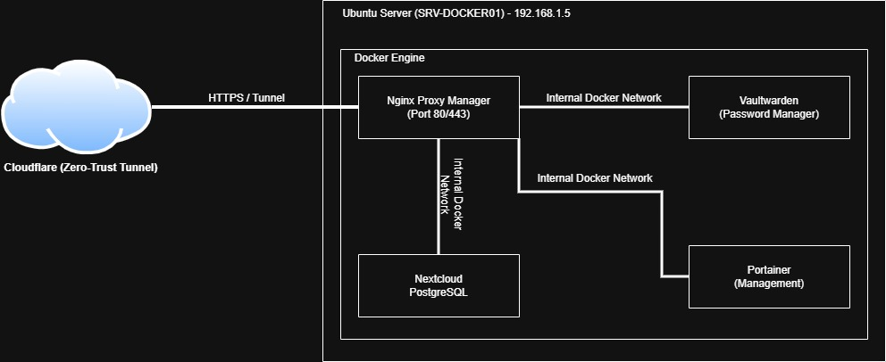
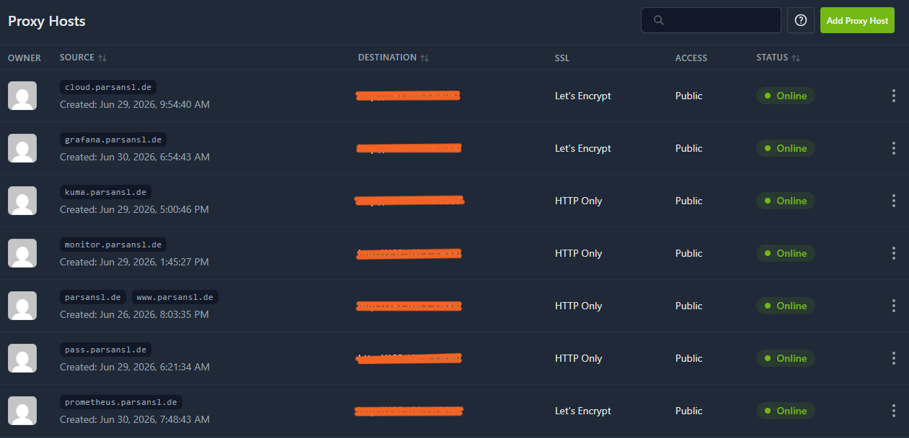
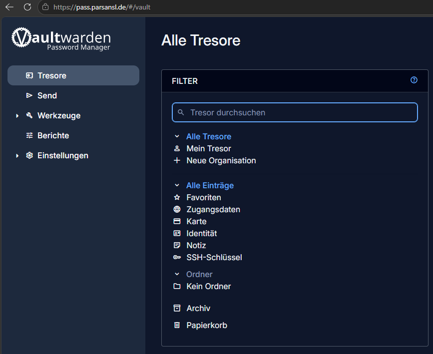
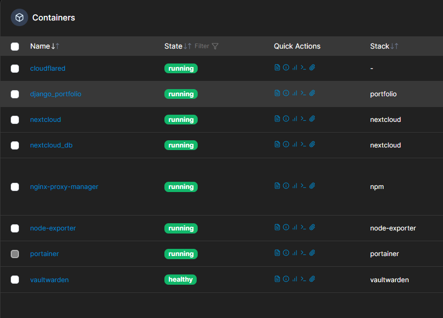

Linux & Docker Microservices: Zero-Trust Cloud Infrastructure

Dieses Projekt dokumentiert den Aufbau einer sicheren, containerisierten Server-Infrastruktur auf Basis von Ubuntu Linux und Docker. Die Bereitstellung der Microservices erfolgte nach dem "Infrastructure as Code" (IaC) Prinzip. Alle Schritte wurden nach der STAR-Methode dokumentiert.

## Container Architecture & Traffic Routing

--------------------------------

Phase 1: Aufbau einer isolierten Docker-Microservices-Umgebung
Situation:
Für die Bereitstellung moderner Web-Dienste und Microservices wurde eine ressourcenschonende, sichere und hochperformante Laufzeitumgebung benötigt. Die direkte Installation von Diensten auf dem Host-System oder die Vermischung von Diensten auf einem einzigen Server (Monolith-Ansatz) entspricht nicht den Best Practices für Sicherheit und Skalierbarkeit.

Task:
Planung und Erstellung einer dedizierten virtuellen Maschine (VM) unter Proxmox VE, die als reine Docker-Host-Umgebung (Headless Linux) fungieren soll, eingebettet in das interne, durch eine pfSense-Firewall geschützte VLAN.

Action:
Eine neue VM (Hostname: SRV-DOCKER01) wurde mit dem Ubuntu 26.04 Live-Server Image provisioniert. Die Konfiguration wurde speziell für maximale Performance und SSD-Schonung optimiert:

CPU: Zuweisung von 2 vCPUs im host-Modus, um die native Architektur und Befehlssätze des physischen Prozessors ohne Emulationsverluste zu nutzen.

Storage: 50 GB SCSI-Laufwerk via virtio-scsi-single Controller. Aktivierung von iothread für asynchrone I/O-Verarbeitung und discard (TRIM), um die Lebensdauer der zugrundeliegenden NVMe-SSD zu maximieren.

Network: Anbindung über eine paravirtualisierte VirtIO-Netzwerkkarte an die interne LAN-Bridge (vmbr1), direkt hinter der pfSense-Firewall.

Management: Aktivierung des QEMU Guest Agents zur reibungslosen Kommunikation zwischen Hypervisor und Gast-Betriebssystem.

Result:
Die virtuelle Infrastruktur für den Docker-Host wurde erfolgreich, performant und sicher implementiert. Durch die strikte Netzwerktrennung und die Storage-Optimierungen wurde ein robustes Fundament für die anstehenden Container-Deployments (IaC via Docker Compose) geschaffen, das Enterprise-Standards entspricht.

--------------------------------

Phase 2: Betriebssystem-Installation und Basis-Konfiguration
Situation:
Nach der Bereitstellung der virtuellen Hardware musste das Gast-Betriebssystem installiert werden. Es war essenziell, eine leichtgewichtige und stabile Grundlage für die Docker-Engine zu schaffen, die keine unnötigen Ressourcen (wie eine GUI) verbraucht und sich nahtlos in das bestehende Netzwerk (hinter pfSense) integriert.

Task:
Manuelle Installation von Ubuntu Server 26.04 LTS (Headless) mit spezifischen Storage-Anpassungen und der Einrichtung von Remote-Zugriffen.

Action:

Der Installationsprozess wurde durchgeführt, wobei das gesamte 50 GB SCSI-Laufwerk als primäre Partition (ext4) konfiguriert wurde.

Um den Speicherplatz für zukünftige Container-Volumes (z.B. Nextcloud Data) vollständig und ohne Restriktionen nutzbar zu machen, wurde bewusst auf die Nutzung von LVM (Logical Volume Manager) verzichtet.

Zusätzlich wurde der OpenSSH-Server direkt während der Installation aktiviert und das System nach dem ersten Bootvorgang vollständig aktualisiert (apt update && apt upgrade).

Result:
Das Betriebssystem (SRV-DOCKER01) bootet stabil und bezieht erfolgreich eine interne IP-Adresse via DHCP. Durch den Verzicht auf eine grafische Oberfläche beträgt die Baseline-Speicherauslastung (RAM) lediglich 7%. Der Server ist nun per SSH vom Administrator-Client aus erreichbar, was ein sauberes und dokumentiertes Infrastructure-as-Code (IaC) Deployment in den nächsten Schritten ermöglicht.

--------------------------------

Phase 3: Netzwerkkonfiguration und Docker-Engine Deployment
Situation:
Nach der initialen OS-Installation bestand die Notwendigkeit, eine dauerhaft stabile Netzwerkverbindung zu etablieren. Eine dynamische IP-Vergabe (DHCP) durch die pfSense-Firewall ist für Server-Infrastrukturen fehleranfällig. Zudem fehlte dem Host-System die Container-Laufzeitumgebung, um Microservices betreiben zu können.

Task:
Manuelle Konfiguration einer statischen IP-Adresse und des Default-Gateways direkt im Gast-Betriebssystem. Anschließend Fehlerbehebung von Routing-Problemen und die sichere Installation der offiziellen Docker-Engine (inkl. Docker Compose) nach Enterprise-Best-Practices.

Action:

Netzwerk: Die IP-Konfiguration wurde von DHCP auf eine statische Zuweisung umgestellt. Dies erfolgte präzise über die Netplan-YAML-Konfiguration (/etc/netplan/), wobei das korrekte Default-Gateway und die DNS-Nameserver definiert wurden, um ausgehenden Traffic (Internet) zu gewährleisten.

Firewall & Routing: Um Remote-Zugriff (SSH) aus dem externen Netz (LAN/WAN) über Port-Forwarding zu ermöglichen, wurden die restriktiven "Bogon/Private Networks"-Blockaden auf der pfSense-Firewall temporär angepasst und dedizierte NAT/Firewall-Regeln verifiziert.

Docker Deployment: Anstatt auf eingeschränkte Snap-Pakete zurückzugreifen, wurden die offiziellen GPG-Schlüssel von Docker importiert und das offizielle Repository (apt) eingebunden. Installiert wurden docker-ce, docker-ce-cli, containerd.io und das docker-compose-plugin. Zur Einhaltung von Berechtigungskonzepten wurde der administrative Benutzer der docker-Gruppe hinzugefügt (Least-Privilege-Prinzip für die Kommandozeile).

Result:
Der Linux-Host verfügt nun über eine unveränderliche, statische Netzwerkkonfiguration und vollständige Internetkonnektivität. Die Docker-Engine läuft als Systemdienst stabil im Hintergrund und wurde erfolgreich durch den hello-world Container validiert. Die Umgebung ist nun vollständig bereit für das Infrastructure-as-Code (IaC) Deployment kommender Microservices.

--------------------------------

Phase 4.1: Implementierung eines Reverse Proxys (Nginx Proxy Manager)
Situation:
Um auf dem Docker-Host zukünftig mehrere Microservices (z.B. Web-Applikationen, Cloud-Dienste) über eine einzige öffentliche IP-Adresse bereitzustellen, war eine intelligente Traffic-Routing-Lösung erforderlich. Die direkte Freigabe einzelner Container-Ports an das externe Netzwerk stellt ein hohes Sicherheitsrisiko dar und erschwert das zentrale Zertifikatsmanagement (SSL/TLS).

Task:
Bereitstellung und Konfiguration eines zentralen Reverse Proxys (Nginx Proxy Manager) als Gateway-Container. Ziel war es, eingehenden HTTP/HTTPS-Traffic zentral zu empfangen, SSL-Terminierung zu ermöglichen und Anfragen dynamisch an die entsprechenden internen Docker-Netzwerke weiterzuleiten.

Action:

Verzeichnisstruktur: Erstellung einer standardisierten Verzeichnisstruktur (~/docker/npm/) auf dem Linux-Host zur sauberen Trennung von Container-Daten und Konfigurationsdateien.

Infrastructure as Code (IaC): Entwicklung einer docker-compose.yml Datei zur deklarativen Bereitstellung des Nginx Proxy Managers.

Port-Binding & Volumes: Gezieltes Mapping der externen Ports 80 (HTTP) und 443 (HTTPS) für den Web-Traffic, sowie Port 81 für das administrative Web-Interface. Konfiguration persistenter Volumes (./data und ./letsencrypt), um Konfigurationen und ausgestellte SSL-Zertifikate bei Container-Neustarts dauerhaft zu speichern.

Deployment: Ausführung der Container-Umgebung im Detached-Modus (docker compose up -d) und initiale Absicherung des Admin-Panels durch Änderung der Standard-Zugangsdaten.

Result:
Der Nginx Proxy Manager läuft stabil als isolierter Container und fungiert nun als zentraler, sicherer Eintrittspunkt (Single Point of Entry) für das gesamte Docker-Ökosystem. Das System ist bereit, zukünftige Web-Dienste mit automatisierten Let's Encrypt SSL-Zertifikaten (HTTPS) sicher im Netzwerk oder Internet zu publizieren.

** Nginx Proxy Manager (Routing & SSL):**

--------------------------------

Phase 4.2: Implementierung eines Zero-Knowledge Password Managers (Vaultwarden)
Situation:
Für die sichere Verwaltung von sensiblen Zugangsdaten und Passwörtern im eigenen Netzwerk wurde eine selbstgehostete, hochsichere Enterprise-Lösung benötigt. Das Ziel war es, die Abhängigkeit von Drittanbietern (Cloud-Diensten) zu eliminieren und gleichzeitig weltweiten, sicheren Zugriff zu gewährleisten, ohne Ports am lokalen Router (FritzBox/Vodafone-Station) zu öffnen.

Task:
Die Aufgabe bestand darin, Vaultwarden (einen leichtgewichtigen Bitwarden-kompatiblen Server) als isolierten Docker-Microservice zu deployen. Dieser Dienst sollte über den Nginx Proxy Manager (NPM) geroutet und durch einen Cloudflare Zero Trust Tunnel mit Let's Encrypt SSL-Zertifikaten nach außen abgesichert werden.

Action:

Docker Deployment: Erstellung einer docker-compose.yml, um den Vaultwarden-Container zu definieren. Dabei wurde ein persistentes Volume (vw-data) gemountet, um die Datenbank vor Datenverlust zu schützen, und der interne Port 8080 freigegeben.

Zero-Trust Routing: Konfiguration eines Cloudflare Tunnels (Public Hostname), um externen Traffic für die Subdomain nahtlos und verschlüsselt an die interne IP des Docker-Hosts (192.168.1.5:80) zu leiten.

Reverse Proxy Konfiguration & Troubleshooting: Einrichten des Proxy Hosts im NPM. Während der Konfiguration trat ein ERR_TOO_MANY_REDIRECTS (Infinite Loop) auf. Dieses Netzwerkproblem wurde erfolgreich analysiert und behoben, indem die redundante Force SSL-Erzwingung am internen Proxy deaktiviert wurde, da Cloudflare bereits die SSL-Terminierung (Edge Encryption) übernahm. Ein temporärer 502 Bad Gateway Fehler wurde durch korrekte Container-Referenzierung beseitigt.

Result:
Der Password Manager ist nun unter https://pass.parsansl.de weltweit erreichbar. Die Infrastruktur ist durch Ende-zu-Ende-Verschlüsselung, striktes SSL und Zero-Trust-Tunneling maximal abgesichert. Die Passwörter verbleiben zu 100 % lokal auf dem eigenen Server, was höchste Datenhoheit (Data Sovereignty) garantiert.

** Live Service Validation (SSL Secured):**

--------------------------------

Phase 4.3: Implementierung eines Enterprise Cloud-Speichers (Nextcloud + PostgreSQL)
Situation:
Um die volle Kontrolle über sensible Daten zu behalten und die Abhängigkeit von Public-Cloud-Anbietern zu eliminieren, wurde eine private Cloud-Infrastruktur benötigt. Die Standard-Installation (mit SQLite) war für parallele Zugriffe und große Dateimengen (Multi-User-Betrieb, automatische Datei-Synchronisation) unzureichend, weshalb eine hochperformante, skalierbare Datenbankarchitektur zwingend erforderlich war.

Task:
Bereitstellung von Nextcloud als Docker-Container, gekoppelt mit einem robusten relationalen Datenbank-Backend (PostgreSQL 15). Das System sollte über eine eigene interne Docker-Bridge vernetzt und sicher über den Cloudflare Zero Trust Tunnel (via Nginx Proxy Manager) nach außen publiziert werden. Dabei mussten höchste Sicherheitsstandards für das Management von Zugangsdaten eingehalten werden.

Action:

Multi-Container Deployment (IaC): Entwicklung einer erweiterten docker-compose.yml, die zwei voneinander abhängige Services (nextcloud und db) definiert.

Secret Management (.env): Zur Einhaltung strenger Security Best Practices wurde eine versteckte .env-Datei auf dem Server implementiert. Sensible Datenbank-Passwörter wurden aus der Versionskontrolle (docker-compose.yml) entfernt und sicher über Variablen-Substitution (z.B. ${DB_PASS}) zur Laufzeit injiziert.

Database Integration: Automatisierte Verknüpfung der Container über Umgebungsvariablen (POSTGRES_DB, POSTGRES_USER), sodass der manuelle Setup-Wizard übersprungen und die Datenbank direkt beim Start nahtlos integriert wurde.

Storage & Routing: Mounten von lokalen Volumes (nc-data, db-data) zur Gewährleistung der Datenpersistenz. Anschließend wurde der Traffic im Nginx Proxy Manager (Port 8081) und in Cloudflare für die Subdomain cloud.parsansl.de konfiguriert und mit einem Let's Encrypt SSL-Zertifikat abgesichert.

Result:
Der private Cloud-Speicher läuft nun hochperformant und weltweit sicher erreichbar unter https://cloud.parsansl.de. Durch den Einsatz von PostgreSQL als Backend ist die Infrastruktur Enterprise-ready und skaliert hervorragend. Dank des ausgelagerten Secret Managements ist das Deployment vollständig "Clean Code"-konform und garantiert zu 100 % Datenhoheit (Data Sovereignty) auf dem eigenen Server.

--------------------------------

Phase 5: Zentralisiertes Container-Management (Portainer)
Situation:
Mit der wachsenden Anzahl an Microservices (Vaultwarden, Nextcloud, NPM) wurde die reine Verwaltung über das Command Line Interface (CLI) unübersichtlich und ineffizient. Es fehlte eine visuelle Monitoring-Lösung, um Ressourcenauslastung, Logs und den Status der Docker-Container in Echtzeit zu überwachen.

Task:
Bereitstellung von Portainer Community Edition als grafisches Management-Interface. Die Plattform musste direkten Zugriff auf die Docker-Engine erhalten, durfte aber aus Sicherheitsgründen nicht direkt ins Internet exponiert werden.

Action:

Deployment & Socket-Binding: Ausrollen des Portainer-Containers mittels docker-compose.yml. Das kritische Volume /var/run/docker.sock wurde gemountet, um Portainer die API-Steuerung der lokalen Docker-Umgebung zu ermöglichen.

Security Timeout Handling: Erfolgreiches Troubleshooting des initialen Sicherheits-Timeouts (Setup Token Requirement) durch gezielten Container-Neustart zur sicheren Anlage des Admin-Kontos.

Zero-Trust Routing: Der interne Port wurde analog zu den anderen Services über den Nginx Proxy Manager und den Cloudflare Tunnel als monitor.parsansl.de mit erzwungenem HTTPS (Let's Encrypt) nach außen isoliert.

Result:
Die gesamte Container-Infrastruktur kann nun über ein intuitives Web-Interface zentral gesteuert und überwacht werden. Die Lösung bietet Live-Metriken, vereinfachte Log-Analysen und Container-Management mit maximaler Sicherheit durch die etablierte Zero-Trust-Architektur.

** Portainer CE (Live Container Management):**

--------------------------------

Phase 6: Infrastructure Hardening & Zero-Trust Access (SSH Public Key)
Situation:
Nach der erfolgreichen Bereitstellung der Docker-Microservices musste die Sicherheit des zugrundeliegenden Linux-Hosts (Ubuntu Server) auf Enterprise-Niveau gehoben werden. Herkömmliche passwortbasierte Logins stellen ein signifikantes Sicherheitsrisiko dar, da sie anfällig für automatisierte Brute-Force- und Dictionary-Angriffe aus dem Netzwerk sind.

Task:
Deaktivierung der passwortbasierten Authentifizierung am Server und die vollständige Umstellung auf asymmetrische Public-Key-Kryptografie (SSH Keys), um unbefugten Zugriff strukturell unmöglich zu machen.

Action:

Schlüsselerstellung: Generierung eines sicheren RSA-Schlüsselpaares am lokalen Windows-Client über das Command Line Interface (ssh-keygen).

Key-Deployment: Der öffentliche Schlüssel (id_rsa.pub) wurde in das Verzeichnis ~/.ssh/authorized_keys des Linux-Servers importiert, um den Client eindeutig zu verifizieren.

System-Hardening: Anpassung der kritischen Konfigurationsdatei /etc/ssh/sshd_config. Die Direktive PasswordAuthentication wurde strikt auf no gesetzt. Nach einem Neustart des SSH-Daemons (systemctl restart ssh) wurde der Server für sämtliche passwortbasierten Login-Versuche gesperrt.

Result:
Der administrative Zugang zum Server ist nun maximal abgesichert. Der Login erfolgt nahtlos, hochsicher und ausschließlich über den kryptografischen Schlüssel des autorisierten Clients (dokumentiert durch erfolgreichen schlüssellosen Login). Die Server-Infrastruktur entspricht damit vollumfänglich modernen Zero-Trust- und DevOps-Sicherheitsstandards.
